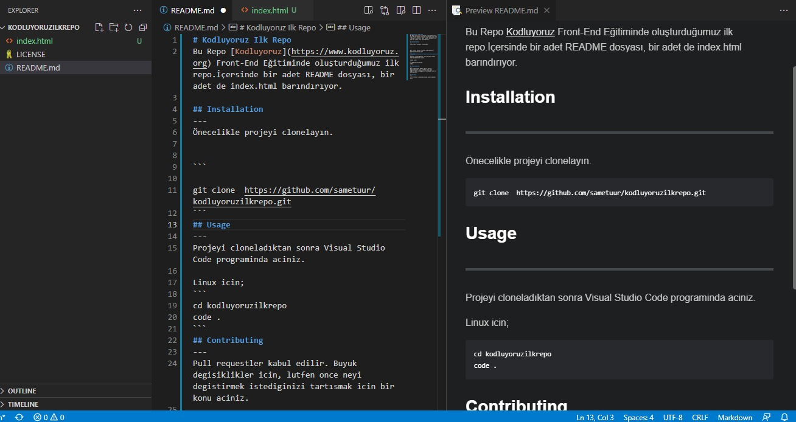

# Kodluyoruz Ilk Repo
Bu Repo [Kodluyoruz](https://www.kodluyoruz.org) Front-End Eğitiminde oluşturduğumuz ilk repo.İçersinde bir adet README dosyası, bir adet de index.html barındırıyor.

## Installation
---
Önecelikle projeyi clonelayın.


```

git clone  https://github.com/sametuur/kodluyoruzilkrepo.git
```
## Usage
---
Projeyi cloneladıktan sonra Visual Studio Code programinda aciniz.

Linux icin;
```
cd kodluyoruzilkrepo
code .
```
## Contributing
---
Pull requestler kabul edilir. Buyuk degisiklikler icin, lutfen once neyi degistirmek istediginizi tartısmak icin bir konu aciniz.

## License
---
[MIT](https://choosealicense.com/licenses/mit/)

